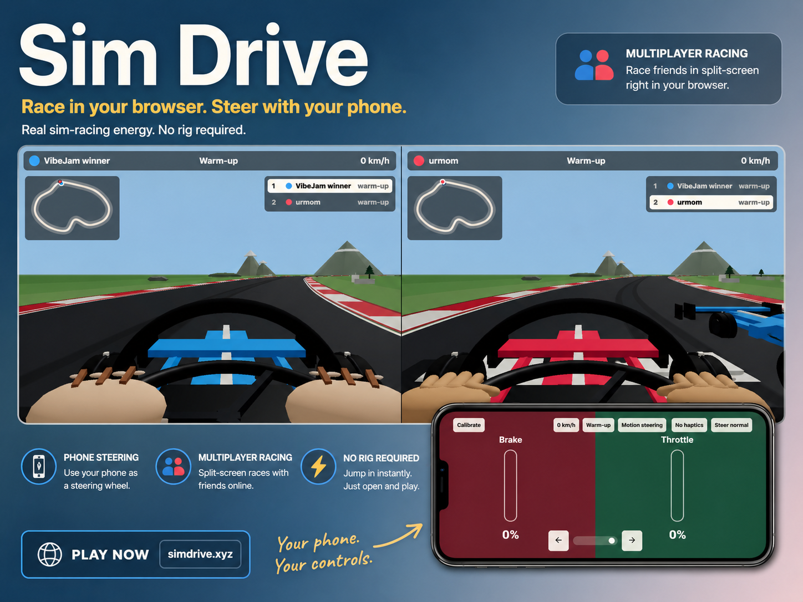

# Sim Drive

Sim Drive is a multiplayer browser racing game where a shared display hosts the race and phones become tilt-steering controllers.



## Status

Playable prototype in active development. The core room flow, phone controller, server-authoritative race loop, split-screen display, vehicle selection, procedural tracks, audio, and optional haptics are working.

## Run locally

```bash
npm install
npm run dev
```

Open the display at `http://localhost:5173/`. The dev server also prints a LAN URL, which is useful for joining from a real phone on the same network. Phone motion sensors require a secure origin in Chrome/Chromium and iOS Safari/WebKit, so use the HTTPS Codespaces/forwarded URL, production HTTPS URL, or an HTTPS tunnel when testing tilt steering; plain LAN `http://` may only work in Firefox.

In GitHub Codespaces, open the forwarded `5173` port URL. The app proxies WebSockets through the same forwarded origin, so you do not need to separately open port `8787` for normal dev use.

## Current playable slice

### Room flow

- Create a room from a display browser.
- Join from a phone controller by QR code or room code.
- Phone controller refreshes and same-phone QR rescans auto-resume the saved driver when possible.
- First joined controller becomes VIP.
- Lobby shows the QR code, race settings, selected track, driver lineup, each driver's vehicle, setup, and cockpit style.
- The home screen shows a live active-driver count only when at least one driver is online.
- One-player practice works.

### Race settings

- VIP can choose track, laps, pre-race tutorial, warm-up/flying start, ghost cars, rain, gentle stability assist, and reset mode.

### Vehicles and driver options

- Each driver can choose a vehicle: Formula Prototype, KZ Kart, Stock Truck, or Tuk-Tuk.
- Formula Prototype and Stock Truck offer Balanced, High Grip, and High Speed setups; KZ Kart and Tuk-Tuk use a fixed setup.
- Each driver can choose a personal cockpit style: None, Hands, or Paws; new players default to None.
- Each driver can choose a personal rear-view mirror mode: Auto, On, or Off; new players default to Auto, which shows it when other active cars exist.

### Race display

- Display landing/lobby/tutorial/results screens support System, Light, and Dark themes.
- Five tracks are available: Sakura Sprint, Alpine Grand Prix, Fjord Loop, Keys Causeway, and Cloudline Ascent.
- Race view renders a cockpit-style 3D scene with smooth procedural track ribbons, raised curbs, rubber/skid road detail, generated terrain support for elevated tracks, vehicle-specific cockpit silhouettes, countdown lights, and a short first-place banner.
- Race view includes a minimap, live global leaderboard, rear-view mirror, and display-side auto-spectate for finished racers while others are still active.
- Results include podium-style placement, total time, and best lap.

### Phone controller

- Phone controller supports tilt steering with iOS/WebKit motion permission prompts, Chrome-friendly `devicemotion`/Generic Sensor fallbacks, countdown-time steering centering, 1-10 motion sensitivity, saved motion-steering inversion, fallback touch steering, touch brake/throttle zones, first-tap pedal preferences, motion/audio/haptic tests, quick countdown control hints, vehicle-specific/nearby-rival audio, and vibration where supported.
- Controller setup/lobby screens show a recommended-browser notice when the phone is not on the preferred Android Chromium-style browser path.
- Web vibration depends on browser support. Android Chromium/Samsung-style browsers are the main target; iOS Safari does not support it; Firefox Android may expose partial/no-op support.

### Server behavior

- Server owns room state, race phase, vehicle-specific velocity-based movement, per-driver setup multipliers, warm-up/flying start timing, downforce-style speed-building grip, elevation/grade effects, tuk-tuk rollover risk, optional crash/off-track reset, checkpoint-gated lap completion, directional collisions, DNF handling, and results.
- If every display/host browser disconnects, the room stays resumable for a 20-second grace window. If no display reconnects in that window, the room closes and controllers are sent back out of the game.

## Project docs

- `SPEC_detailed.md`: canonical product and technical spec.
- `FEATURES.md`: product-facing feature summary.
- `HUMAN_CHECKS.md`: real-device phone playtest checklist.
- `PLAYTEST_AUTOMATION.md`: automated full-lap and visual capture workflow.
- `DRIVER_FEEDBACK.md`: phone-side audio and haptic mapping.
- `CARS.md`: current vehicle and handling notes.
- `PERFORMANCE.md`: race performance, networking, rendering, and new-track engineering notes.
- `REMINDERS.md`: follow-up ideas.

## Useful commands

```bash
npm run typecheck
npm run build
npm start
```

`npm start` serves the production build and WebSocket server from one Node process on port `8787`.

## Contributing

Issues and pull requests are welcome. Keep changes scoped, update the relevant docs when behavior changes, and run `npm run typecheck` plus `npm run build` before opening larger changes.
